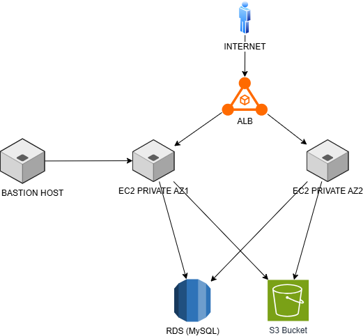
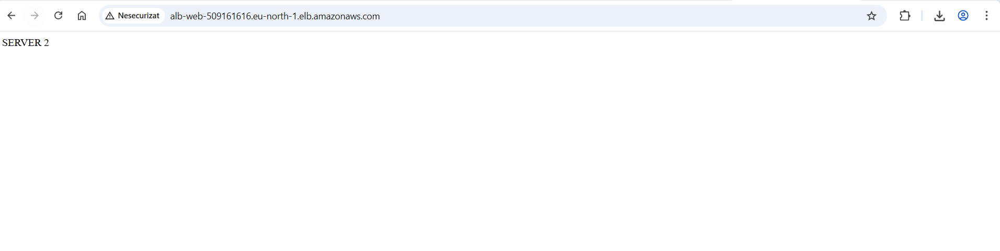
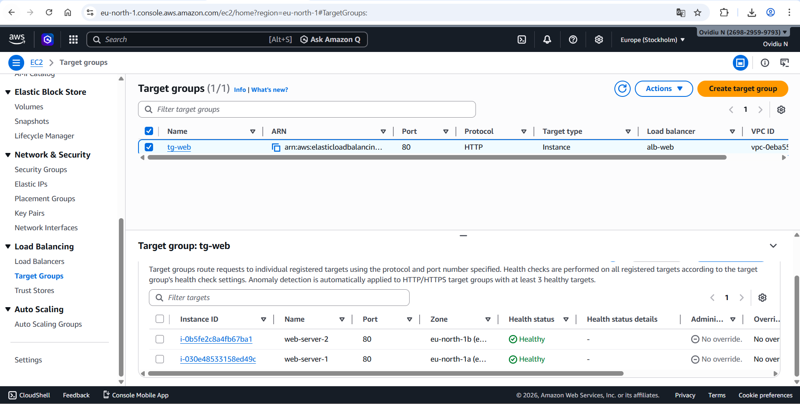
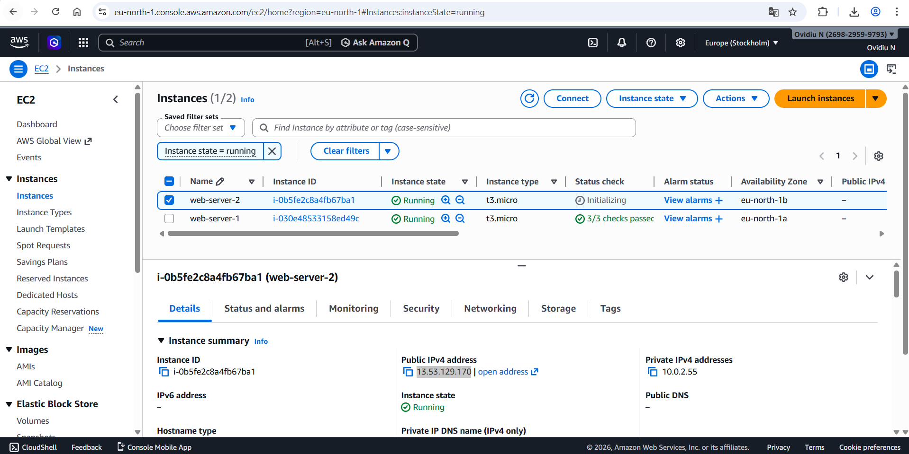
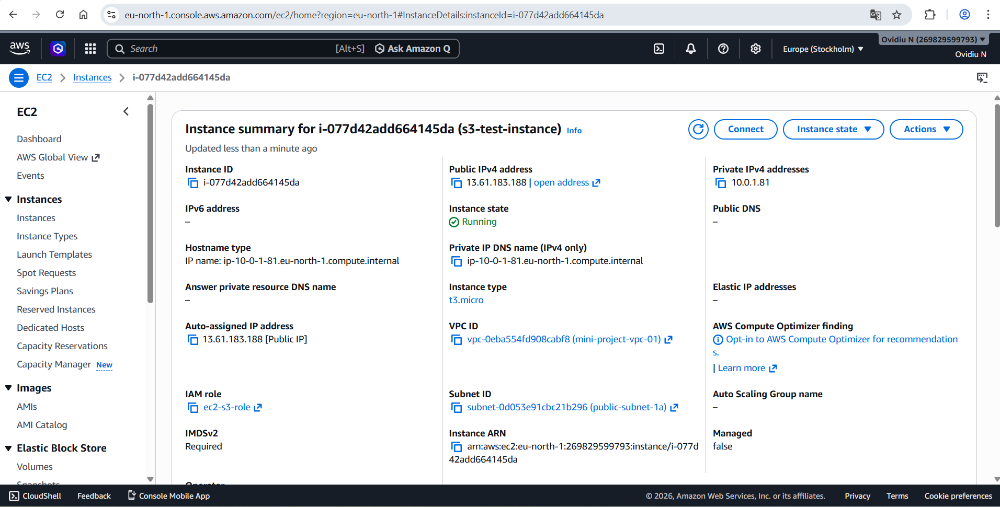
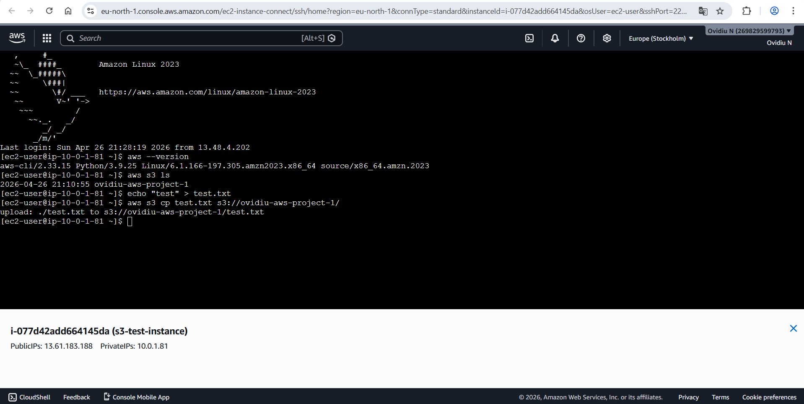
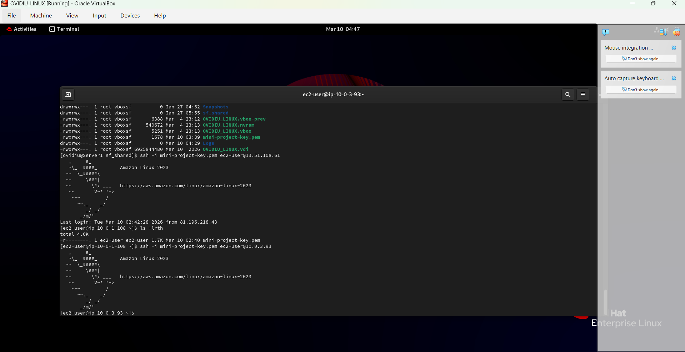
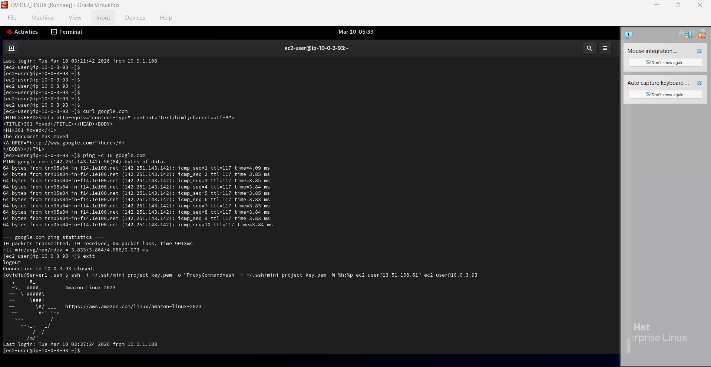
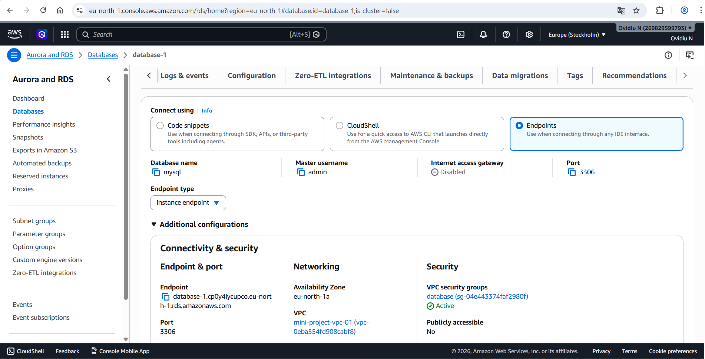
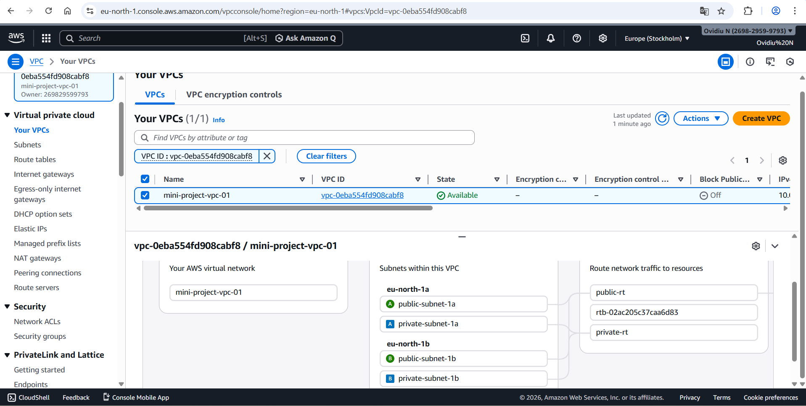

# aws-highly-available-web-architecture
AWS project demonstrating high availability, load balancing, auto scaling and secure networking

## Key skills demonstrated:
- AWS VPC (public & private subnets)
- Multi-AZ high availability architecture
- Application Load Balancer (ALB)
- Auto Scaling Group (ASG)
- Amazon RDS integration
- IAM roles for secure service access
- Linux (RHEL) system configuration

## Architecture Diagram

High-level architecture showing traffic flow, high availability across Availability Zones, and secure access to private resources.

## Detailed Architecture
See full explanation: [Architecture Explanation](architecture-explanation.md)

## Overview
This project demonstrates a production-style AWS architecture focused on high availability, scalability, and security best practices.

## Architecture
- Multi-AZ deployment
- Application Load Balancer
- Auto Scaling Group
- Private RDS database
- Bastion host for secure access
- S3 integration via IAM Role

## Architecture Flow:

Internet → ALB → EC2 (Auto Scaling Group) → RDS  
EC2 → S3

EC2 instances handle both application logic and interactions with storage services.

## Networking
- Custom VPC (10.0.0.0/16)
- 2 Public Subnets (ALB, Bastion)
- 2 Private Subnets (EC2, RDS)
- Internet Gateway
- Route Tables

## Compute
- EC2 instances (Amazon Linux 2023)
- Nginx installed via User Data
- Instances launched via Launch Template

## Load Balancer
- Application Load Balancer (public)
- Distributes traffic across instances
- Health checks configured

## Auto Scaling
- Auto Scaling Group used for high availability
- Min: 1 / Max: 2
- Automatic instance replacement (self-healing)

## Database
- Amazon RDS (MySQL)
- Private subnet deployment
- Access only from EC2 Security Group

## Storage
- Amazon S3
- Access via IAM Role (no credentials stored)
- Tested from EC2

## Security
- Bastion host for SSH access
- Private instances without public IP
- Security Groups (least privilege)

## Testing
- Load balancing verified
- Instance failover tested
- RDS connection tested
- S3 upload tested
- NAT Gateway tested and removed

## Cost Optimization
- NAT Gateway removed
- RDS deleted after testing
- EC2 instances terminated

## Key Concepts
- High Availability
- Load Balancing
- Auto Scaling
- Secure Networking
- IAM Roles
- Private Database Access

## Conclusion
This project simulates a real-world AWS architecture suitable for entry-level cloud engineering roles.

## Screenshots

## Application Load Balancer (Browser Test)

 

- Application Load Balancer is working
- Traffic is distributed across instances
- Response confirms correct routing (web-server-2)

## Target Group (2 Healthy Instances)

 

- 2 instances registered in the target group
- Both are healthy
- Health checks are working correctly

## EC2 Instances

 

- 2 EC2 instances running
- Deployed across different Availability Zones
- Used for high availability

## EC2 Details (IAM Role)

 

- EC2 instance with IAM Role attached
- Secure access to AWS services (S3)
- No access keys used

## S3 Access via IAM Role (CLI Test)

 

- Access to S3 from EC2 via IAM Role
- File uploaded using AWS CLI
- Confirms correct permissions

## Bastion Host (SSH Access)

 

- SSH connection to bastion host
- Secure entry point into the VPC
- Used to access private resources

## SSH ProxyCommand (Bastion → Private Instance)

 

- Access to private instance via bastion
- Using ProxyCommand
- No direct internet exposure

## NAT Gateway Test (Ping / Curl)

 

- Private instance has internet access
- Tested using ping / curl
- Outbound traffic via NAT Gateway

## RDS (MySQL Database)

 

- MySQL database configured
- Deployed inside VPC
- Access controlled via security group

## VPC and Subnets

 

- Custom VPC configured
- Public and private subnets
- Separate routing (public / private)
